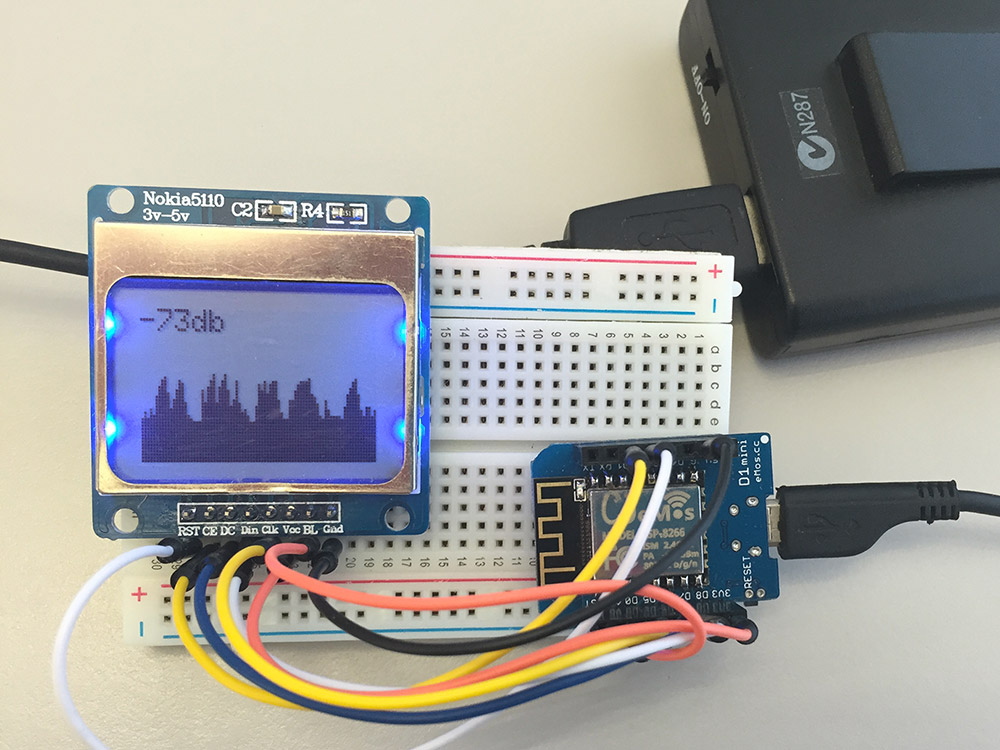

# ESP8266 WiFi Signal Strength Graph

Graph your WiFi signal strength RSSI (dBm) on a Nokia 5110 PCD8544 LCD module.

Signal strength (RSSI) is the usable strength of the radio waves, expressed in decibels (db) between 0db (strongest) and -120db (weakest).
The closer it is to zero, the stronger/cleaner the signal is.
For WiFi, the normal range is -45db to -87db.
Anything below -85db is generally unusable, and over -50db can be considered perfect.

| RSSI     | Quality   |
| -------- | --------- |
| > -50db  | Fantastic |
| ~= -50db | Great     |
| ~= -75db | Average   |
| ~= -85db | Poor      |
| ~= -95db | Unusable  |

## Materials:

* WeMos D1 Mini (ESP8266)
* Nokia 5110 PCD8544 84x48 monochrome LCD
* 8 jumper wires
* Breadboard
* 5V power source (USB 4xAA battery pack)

## Dependencies:

Add these to your Arduino IDE using Manage Libraries.

* [Adafruit GFX Library](https://github.com/adafruit/Adafruit-GFX-Library)
* [Adafruit PCD8544 Nokia 5110 LCD library](https://github.com/adafruit/Adafruit-PCD8544-Nokia-5110-LCD-library)
  * There is a pull request that adds ESP8266 support:
  * [adafruit/Adafruit-PCD8544-Nokia-5110-LCD-library#27](https://github.com/adafruit/Adafruit-PCD8544-Nokia-5110-LCD-library/pull/27)
  * If this has not been merged yet, you will need to manually copy the changes across

## Breadboard connections:

| WeMos D1 Mini | Nokia 5110 PCD8544 LCD | Description                                    |
| ------------- | ---------------------- | ---------------------------------------------- |
| D2 (GPIO4)    | 0 RST                  | Output from ESP to reset display               |
| D1 (GPIO5)    | 1 CE                   | Output from ESP to chip select/enable display  |
| D6 (GPIO12)   | 2 DC                   | Output from display data/command to ESP        |
| D7 (GPIO13)   | 3 Din                  | Output from ESP SPI MOSI to display data input |
| D5 (GPIO14)   | 4 Clk                  | Output from ESP SPI clock                      |
| 3V3           | 5 Vcc                  | 3.3V from ESP to display                       |
| D0 (GPIO16)   | 6 BL                   | 3.3V to turn backlight on, or PWM              |
| G (GND)       | 7 Gnd                  | Ground                                         |

